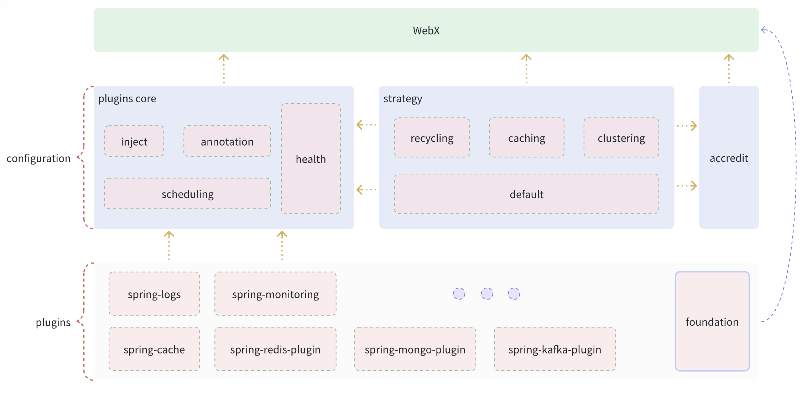

---

#### Clepton

Clepton is a framework to simplify the development of microservices. It can be imported via maven or gradle to implement
the necessary features of microservices (interceptors, authentication, aop, reclaim/cache/cluster policy, service
scheduling) with simple configuration. The WebX layer is also RESTFull for microservices
Api development provides rich data response formats. Provide pluggable, non-intrusive solutions for microservice
components.


#### Documentation

- [中文文档](/lang/zh/README.md)

#### Update content

> [Historical update](/logs/history_update.md)

- Framework plugin module scheduling and design;
- Provide caching policy configuration;
- Refine the WebX service infrastructure;
- Persistence layer MyBatis custom plugin configuration and use (extension on MyBatis, not MyBatis-Plus but similar in
  functionality)
- Improve and enrich REST Full API data response format;

> Content to be updated

- JWT for API one-click authentication and dynamic configuration;
- Implement full service logging (support dynamic configuration and distributed logging framework);
- Integrate and configure distributed service monitoring plugins with one click;
- The framework integrates Spring Security authentication and provides simplified configuration from the validation ->
  UI;

#### Dependent reference

```xml

```

#### Springboot/cloud Fast integration
